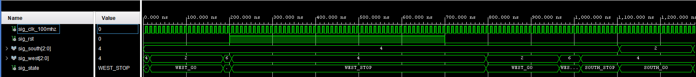
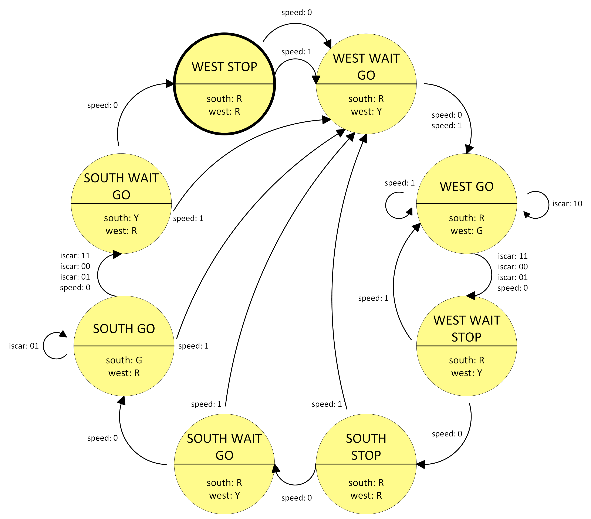

# Lab 8: Vojtěch Javorek

### Traffic light controller

1. Listing of VHDL code of the completed process `p_traffic_fsm`. Always use syntax highlighting, meaningful comments, and follow VHDL guidelines:

```vhdl
    --------------------------------------------------------
    -- p_traffic_fsm:
    -- A sequential process with synchronous reset and
    -- clock_enable entirely controls the s_state signal by
    -- CASE statement.
    --------------------------------------------------------
  p_traffic_fsm : process (clk) is
  begin

    if (rising_edge(clk)) then
      if (rst = '1') then                    -- Synchronous reset
        sig_state <= WEST_STOP;              -- Init state
        sig_cnt   <= c_ZERO;                 -- Clear delay counter
      elsif (sig_en = '1') then
        -- Every 250 ms, CASE checks the value of sig_state
        -- local signal and changes to the next state 
        -- according to the delay value.
        case sig_state is

          when WEST_STOP =>
            -- Speed up to WEST GO when button is pressed
            if (sig_speed = '1') then
              sig_state <= WEST_WAIT_GO;
              sig_cnt <= c_ZERO;
            -- Skip everything else
            -- Count to 2 secs
            elsif (sig_cnt < c_DELAY_2SEC) then
              sig_cnt <= sig_cnt + 1;
            else
              -- Move to the next state
              sig_state <= WEST_WAIT_GO;
              -- Reset local counter value
              sig_cnt <= c_ZERO;
            end if;
            
          when WEST_WAIT_GO =>
            -- Count to 1 secs
            if (sig_cnt < c_DELAY_1SEC) then
              sig_cnt <= sig_cnt + 1;
            else
              -- Move to the next state
              sig_state <= WEST_GO;
              -- Reset local counter value
              sig_cnt <= c_ZERO;
            end if;

          when WEST_GO =>
             -- Count to 4 secs
            if (sig_cnt < c_DELAY_4SEC) then
              sig_cnt <= sig_cnt + 1;
            else
              -- Move to the next state
              -- Don't move if there are no cars in the other direction
              -- Or when the Speed button is pressed
              if (sig_iscar = "10" or sig_speed = '1') then
                sig_state <= WEST_GO;
              else
                sig_state <= WEST_WAIT_STOP;
              end if;
              -- Reset local counter value
              sig_cnt <= c_ZERO;
            end if;
          
          when WEST_WAIT_STOP =>
            -- Speed up to WEST GO when button is pressed
            if (sig_speed = '1') then
              sig_state <= WEST_WAIT_GO;
              sig_cnt <= c_ZERO;
            -- Skip everything else
            -- Count to 1 secs
            elsif (sig_cnt < c_DELAY_1SEC) then
              sig_cnt <= sig_cnt + 1;
            else
              -- Move to the next state
              sig_state <= SOUTH_STOP;
              -- Reset local counter value
              sig_cnt <= c_ZERO;
            end if;
           
          when SOUTH_STOP =>
            -- Speed up to WEST GO when button is pressed
            if (sig_speed = '1') then
              sig_state <= WEST_WAIT_GO;
              sig_cnt <= c_ZERO;
            -- Skip everything else
            -- Count to 2 secs  
            elsif (sig_cnt < c_DELAY_2SEC) then
              sig_cnt <= sig_cnt + 1;
            else
              -- Move to the next state
              sig_state <= SOUTH_WAIT_GO;
              -- Reset local counter value
              sig_cnt <= c_ZERO;
            end if;
          
          when SOUTH_WAIT_GO =>
            -- Speed up to WEST GO when button is pressed
            if (sig_speed = '1') then
              sig_state <= WEST_WAIT_GO;
              sig_cnt <= c_ZERO;
            -- Skip everything else
            -- Count to 1 secs  
            elsif (sig_cnt < c_DELAY_1SEC) then
              sig_cnt <= sig_cnt + 1;
            else
              -- Move to the next state
              sig_state <= SOUTH_GO;
              -- Reset local counter value
              sig_cnt <= c_ZERO;
            end if;
          
          when SOUTH_GO =>
            -- Speed up to WEST GO when button is pressed
            if (sig_speed = '1') then
              sig_state <= WEST_WAIT_GO;
              sig_cnt <= c_ZERO;
            -- Skip everything else
            -- Count to 4 secs  
            elsif (sig_cnt < c_DELAY_4SEC) then
              sig_cnt <= sig_cnt + 1;
            else
              -- Move to the next state
              -- Don't move if there are no cars in the other direction
              if (sig_iscar = "01") then
                sig_state <= SOUTH_GO;
              else
                sig_state <= SOUTH_WAIT_STOP;
              end if;
              -- Reset local counter value
              sig_cnt <= c_ZERO;
            end if;
            
          when SOUTH_WAIT_STOP =>
            -- Speed up to WEST GO when button is pressed
            if (sig_speed = '1') then
              sig_state <= WEST_WAIT_GO;
              sig_cnt <= c_ZERO;
            -- Skip everything else
            -- Count to 1 secs  
            elsif (sig_cnt < c_DELAY_1SEC) then
              sig_cnt <= sig_cnt + 1;
            else
              -- Move to the next state
              sig_state <= WEST_WAIT_GO;
              -- Reset local counter value
              sig_cnt <= c_ZERO;
            end if;

          when others =>
            -- It is a good programming practice to use the
            -- OTHERS clause, even if all CASE choices have
            -- been made.
            sig_state <= WEST_STOP;
            sig_cnt   <= c_ZERO;

        end case;

      end if; -- Synchronous reset
    end if; -- Rising edge
  end process p_traffic_fsm;
```

2. Screenshot with simulated time waveforms. The full functionality of the entity must be verified. Always display all inputs and outputs (display the inputs at the top of the image, the outputs below them) at the appropriate time scale!

   

3. Figure of Moor-based state diagram of the traffic light controller with *speed button* to ensure a synchronous transition to the `WEST_GO` state. The image can be drawn on a computer or by hand. Always name all states, transitions, and input signals!

   

## Pre-Lab preparation

1. See [schematic](https://github.com/tomas-fryza/digital-electronics-1/blob/master/docs/nexys-a7-sch.pdf) or [reference manual](https://reference.digilentinc.com/reference/programmable-logic/nexys-a7/reference-manual) of the Nexys A7 board and find out the connection of two RGB LEDs, ie to which FPGA pins are connected and how. How you can control them to get red, yellow, or green colors? Draw the schematic with RGB LEDs.

| **RGB LED** | **Artix-7 pin names** | **Red** | **Yellow** | **Green** |
| :-: | :-: | :-: | :-: | :-: |
| LD16 | N15, M16, R12 | `1,0,0` | `1,1,0` | `0,1,0` |
| LD17 | N16, R11, G14 | `1,0,0` | `1,1,0` | `0,1,0` |

2. See [schematic](https://github.com/tomas-fryza/digital-electronics-1/blob/master/docs/nexys-a7-sch.pdf) or [reference manual](https://reference.digilentinc.com/reference/programmable-logic/nexys-a7/reference-manual) of the Nexys A7 board and find out to which FPGA pins Pmod ports JA, JB, JC, and JD are connected.